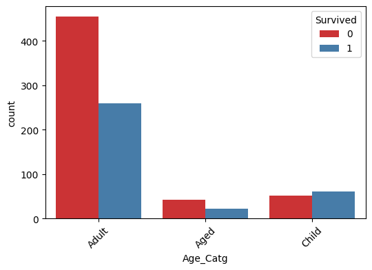
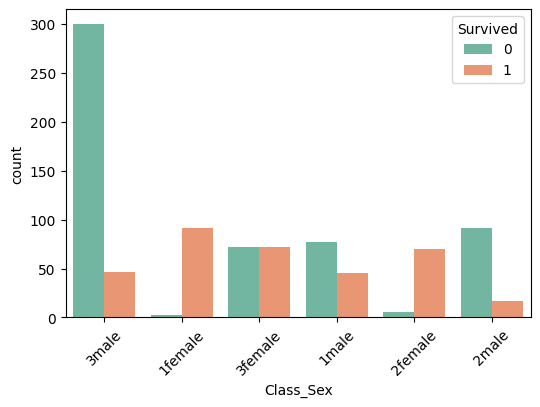
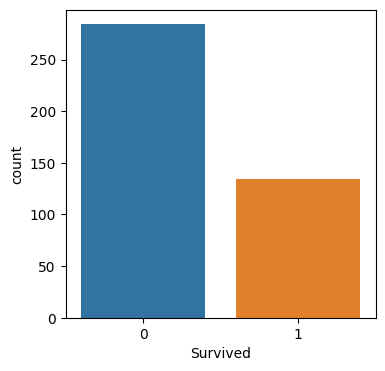

# Titanic - Machine Learning from Disaster
During this project, I built and compared various classification models to predict which passengers survived the Titanic disaster, starting with Logistic Regression and extending to advanced models like Random Forest.

## 📊 Project Overview

- **Goal**: Predict which passengers survived the Titanic disaster.
- **Model Used**: Logistic Regression, K-Nearest Neighbors (KNN), Support Vector Machine (SVM), Decision Tree, Random Forest, Naive Bayes, Multilayer Perceptron (MLP), XGBoost.
- **Dataset Source**: [Kaggle Titanic ML Competition](https://www.kaggle.com/competitions/titanic)

The Titanic dataset is one of the most famous beginner-friendly machine learning datasets. It contains details about passengers such as age, sex, class, and more — and asks us to build a model that can predict survival outcomes.

---

## 🧠 What I Did

I began by cleaning the dataset, handling missing values in the Age, Embarked, and Fare columns, and dropping the Cabin column due to excessive null values. Next, I performed feature engineering by creating a new categorical feature called Age_Catg to group passengers as Child, Adult, or Aged, and combined Pclass and Sex into a single feature called Class_Sex to capture the interaction between socio-economic status and gender. For exploratory data analysis, I visualized survival rates based on passenger class, age category, and gender to identify key patterns.

I then trained and evaluated eight different classification models, comparing their accuracy on the validation set to identify the most effective approach. Finally, I used the best-performing model, Random Forest, to make predictions on the test dataset and visualized the distribution of survival predictions.

I built a dashboard to display the model comparison and performance results, providing an interactive way to visualize how each classification model performs on the Titanic dataset.

---

## 📁 Files

- `TitanicProject.ipynb` — main notebook
- `submission.csv` — final predictions file
- `README.md` — this file

---
##  📌 Dataset Details (from Kaggle)
Train set: 891 passengers with survival labels

Test set: 418 passengers to predict on

Features include:

Name, Age, Sex, Pclass (ticket class), Fare, Embarked, etc.

Target column: Survived (1 = survived, 0 = did not)

## Model Comparison 

Model / Accuracy (Validation)
Logistic Regression: 0.7821%
KNN: 0.6760%
SVM: 0.6369%
Decision Tree: 0.7877%
Random Forest: 0.8045%
Naive Bayes: 0.7598%
MLP (Neural Network): 0.7709%
XGBoost: 0.7989%

## 📊 Visualizations

### Age Category vs Survival
This chart shows the survival rate by age group.

### Class & Sex vs Survival
This plot explores how socio-economic class and gender affected survival rates.

### Final Prediction Distribution
This chart shows how many passengers the model predicted to survive vs. not survive in the test dataset.

### Titanic Dataset Classification Model Comparison Dashboard ( Streamlit ) 
This Dashboard display the model comparison and performance results, providing an interactive way to visualize how each classification model performs on the Titanic dataset.
You can find it in " Streamlit dash.pdf " 

