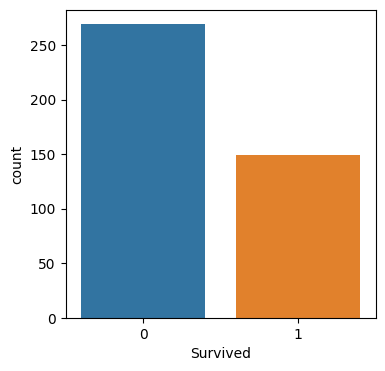

# Titanic - Machine Learning from Disaster
During this Project, I used logistic regression to predict survival on the Titanic dataset.

## 📊 Project Overview

- **Goal**: Predict which passengers survived the Titanic disaster.
- **Model Used**: Logistic Regression
- **Dataset Source**: [Kaggle Titanic ML Competition](https://www.kaggle.com/competitions/titanic)

The Titanic dataset is one of the most famous beginner-friendly machine learning datasets. It contains details about passengers such as age, sex, class, and more — and asks us to build a model that can predict survival outcomes.

---

## 🧠 What I Did

- Cleaned and processed missing data
- Engineered new features:
  1. Age categories: Child / Adult / Aged
  2. Combined class and sex into a single feature
- Visualized patterns in the data (e.g., survival by age, class, and gender)
- Built and evaluated a logistic regression model
- Made predictions on the test set

---

## 📁 Files

- `TitanicProject.ipynb` — main notebook
- `submission.csv` — final predictions file
- `README.md` — this file

---
##  📌 Dataset Details (from Kaggle)
Train set: 891 passengers with survival labels

Test set: 418 passengers to predict on

Features include:

Name, Age, Sex, Pclass (ticket class), Fare, Embarked, etc.

Target column: Survived (1 = survived, 0 = did not)

## 📊 Visualizations

### 👶 Age Category vs Survival
This chart shows the survival rate by age group.

### 🛳️ Class & Sex vs Survival
This plot explores how socio-economic class and gender affected survival rates.

🎯 Final Prediction Distribution
This chart shows how many passengers the model predicted to survive vs. not survive in the test dataset.

